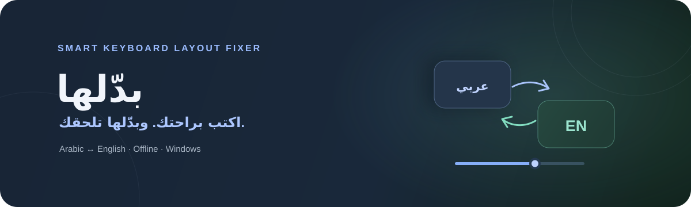

<div align="center">



# بدّلها · Badelha

**مصحّح محلي لتخطيط لوحة المفاتيح العربية والإنجليزية.**
اكتب الكلمة، اضغط مسافة، وسيحاول بدّلها إصلاحها لو اتكتبت بالتخطيط الخطأ.

[](https://github.com/bedaba/smart-layout-switcher/releases/latest)


<br />

[تحميل أحدث نسخة](https://github.com/bedaba/smart-layout-switcher/releases/latest) · [الإبلاغ عن مشكلة](https://github.com/bedaba/smart-layout-switcher/issues)

</div>

## الفكرة

لو كتبت `اثممخ` وأنت تقصد `hello`، بدّلها يراجع الكلمة عند المسافة أو الترقيم. إذا وجد تحويلًا واضحًا بين تخطيطي **QWERTY** و**Arabic 101**، يستبدل الكلمة ويحوّل تخطيط الإدخال للغة الناتجة.

## المميزات

| | الميزة | التفاصيل |
|:--:|---|---|
| ✦ | تصحيح أثناء الكتابة | يفحص آخر كلمة عند المسافة أو علامة الترقيم في Windows. |
| ⇄ | تخطيطان | تحويل بين الإنجليزية وتخطيط العربية 101. |
| ◉ | يعمل محليًا | لا يرسل النص المكتوب إلى خادم ولا يحفظ سجلًا للكلمات. |
| ⚙ | إعدادات بسيطة | إيقاف مؤقت، مستوى الثقة، تشغيل مع تسجيل الدخول، واستثناء تطبيقات. |
| ▣ | علبة النظام | إبقاء التطبيق بالخلفية والتحكم فيه من أيقونته بجانب الساعة. |

## التحميل

افتح [صفحة الإصدارات](https://github.com/bedaba/smart-layout-switcher/releases/latest)، ونزّل أحد مثبّتي Windows:

- **Setup EXE** — مثبت عادي.
- **MSI** — مناسب للتثبيت عبر Windows Installer.

## دعم الأنظمة

| النظام | الحالة |
|---|---|
| Windows x64 | موائم إدخال مضمّن؛ يستخدم تخطيطي العربية والإنجليزية المثبتين في النظام. |
| macOS | غير مدعوم حاليًا. |
| Linux | غير مدعوم حاليًا؛ يتطلب Wayland موائم إدخال خاصًا بمدير النوافذ. |

يعتمد الكشف الحالي على قاموس محلي محدود؛ الكلمات غير الموجودة فيه تُترك دون تغيير. اكتشاف حقول كلمات المرور يقتصر على عناصر Windows القياسية، لذلك يمكن إضافة التطبيقات الحساسة إلى قائمة الاستثناءات.

## البناء من المصدر

المتطلبات: Node.js، وRust، وWebView2 Runtime على Windows.

```powershell
npm install
npm run tauri dev
```

لبناء مثبتَي Windows:

```powershell
npm run tauri build
```

## الخصوصية

يحتفظ المحرك بآخر كلمة في الذاكرة أثناء الكتابة ليقرر إن كان سيصححها، ثم يفرغها عند انتهاء الكلمة أو تبديل النافذة. لا تُكتب الكلمات في إعدادات التطبيق أو سجلاته ولا تُرسل عبر الإنترنت. إعدادات الواجهة تُحفظ محليًا على الجهاز.

<div align="center">

صُنع لتقليل جملة «ياااه كتبتها بلغة غلط» ✦

</div>
